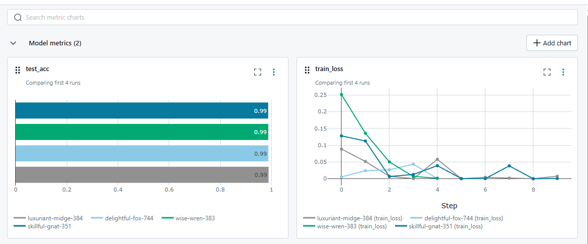
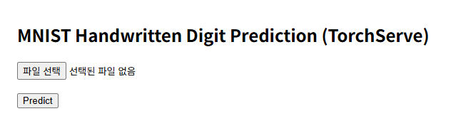

# mlflow-torchserve
Tracking machine learning flow with mlflow, and serving with torchserve

## Install requirements (in linux os)
1. install & activate conda
2. create new env
```bash
pip install -r requirements.txt
```

## MLFLOW

### Launch MLflow UI
```bash
mlflow ui
```
### Train the model
```bash
python train.py
```

## TORCHSERVE
### Create a `.mar` file (already provided)
```bash
torch-model-archiver \
  --model-name mnist_model \
  --version 1.0 \
  --serialized-file serve/mnist_model_state.pt \
  --handler serve/handler.py \
  --extra-files "serve/model.py,serve/__init__.py" \
  --export-path model_store \
  --force
```

### Start TorchServe
```bash
torchserve --start \
  --model-store model_store \
  --models mnist_model=mnist_model.mar \
  --disable-token-auth
```

### Stop TorchServe
```bash
torchserve --stop
```
### If you want to get your own model...
```bash
python
```

```python
import torch
from model import MNISTModel
ckpt = torch.load("your_model_location", map_location="cpu")
if isinstance(ckpt, dict) and "state_dict" in ckpt:
    state_dict = ckpt["state_dict"]
elif isinstance(ckpt, dict):
    state_dict = ckpt
else:
    state_dict = ckpt.state_dict()
torch.save(state_dict, "serve/mnist_model_state.pt")
print("state_dict saved. → serve/mnist_model_state.pt")
```

## Web

Web adress: http://127.0.0.1:8000/
### Initate fastapi APP
```bash
python -m uvicorn app.main:app --reload
```